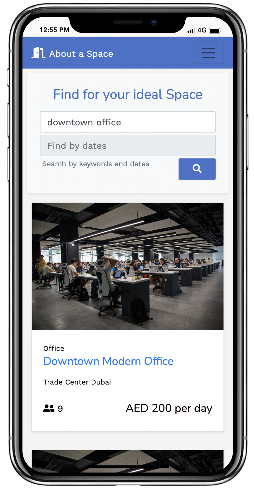

# Welcome 👋 to About a Space

1. [About](#about)
1. [Features](#features)
1. [Screenshots](#screenshots)
1. [Installation](#installation)
1. [Usage](#usage)
1. [Authors and Contributors](#authors-and-contributors)
1. [License](#license)
___
## About

[About a Space](https://about-a-space.herokuapp.com/) is a marketplace for office spaces, conference rooms, and event/function halls. It is akin to Airbnb for commercial spaces design to allow building lease owners to unlock a new revenue stream by renting out their space capacity in their buildings/offices when their staff are readily working from home. It also allows people working from home or digital nomads to easily find a space to work and collaborate, when they want a change of scene from their work setup at home. It also provides an alternative to coffee shope, by providing a guaranteed space for desired amount of days.

It was developed in 1 week as the penultimate project for batch #676 of the [Le Wagon](https://www.lewagon.com/) Web Development Bootcamp in Dubai.

About a Space is a Ruby on Rails web app that uses a base template from [lewagon/rails-templates](https://github.com/lewagon/rails-templates), created by the [Le Wagon](https://www.lewagon.com) team.

Currently it was designed to be fully responsive.

___
## Features

[About a space](https://about-a-space.herokuapp.com/) feature set currently consists of
- User authentication and accounts
- Search for spaces by keyword and/or dates
- See search results and map with the location of the shortlisted spaces
- See details about the space, including the description and reviews.
  - book a space
  - leave reviews for past bookings
- See a dashboard of your bookings and spaces that you've listed
  - list a space that you wish to rent out

___
## Screenshots

### Desktop

<div align="center">
  
  
  
  
  
</div>


### Mobile

<div align="center">
  
  
  
  
  
</div>

___
## Tools

<h3 align="left">Languages and Tools utilized in this project</h3>

<br>

<p align="left">

  <a href="https://www.ruby-lang.org/en/" target="_blank">
   </a>

  <a href="https://rubyonrails.org" target="_blank">
   </a>

  <a href="https://developer.mozilla.org/en-US/docs/Web/JavaScript" target="_blank">
   </a>

  <a href="https://www.w3schools.com/css/" target="_blank">
   </a>

  <a href="https://getbootstrap.com" target="_blank">
   </a>

  <a href="https://git-scm.com/" target="_blank">
   </a>

  <a href="https://www.postgresql.org" target="_blank">
   </a>

  <a href="https://heroku.com" target="_blank">
   </a>

JavaScript Plugins
- [Algolia Places JS](https://community.algolia.com/places/)
- [Typed JS](https://mattboldt.com/demos/typed-js/)
- [AOS](https://michalsnik.github.io/aos/)
- [Sweetalert](https://sweetalert.js.org/)
- [Flatpickr](https://flatpickr.js.org/)
- [BarRating](https://antennaio.github.io/jquery-bar-rating/)

APIs
- [Mapbox](https://www.mapbox.com/)
- [Cloudinary](https://cloudinary.com/)

___
## Schema

<div align="center">

</div>
___
## Installation

Setup data schema and database locally with seed data

```bash
rails db:migrate

rails db: seed
```


To install Ruby Gems and JavaScript plugins:

```bash
bundle install

yarn install
```

Environment variables:
- Mapbox API key
- Cloudinary API key

___
## Usage

To run in localhost:3000

```bash
rails s
```
___
## Authors and Contributors

Sajid Akhtar
- Github: [@Sajakhtar](https://github.com/Sajakhtar)
- LinkedIn: [@sajakhtar](https://www.linkedin.com/in/sajakhtar/)
- Twitter: [@sajakhta](https://twitter.com/Sajakhta)

Lanre Fabunmi
- Github: [@Leprof20](https://github.com/Leprof20)

With special thanks to [Tarig Bouazzati](https://github.com/tbouzza) for the teaching, mentoring and general support during the project.

Pull requests are welcome. For major changes, please open an issue first to discuss what you would like to change.
___
## License
[MIT](https://choosealicense.com/licenses/mit/)

___
